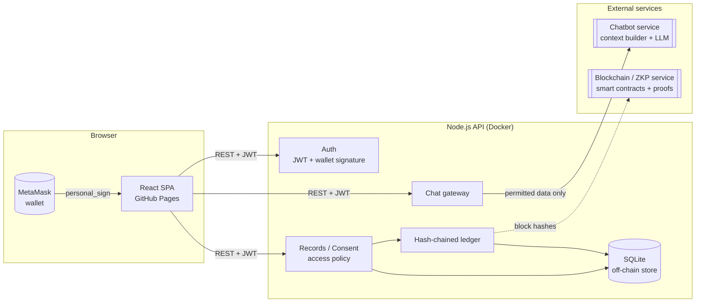

# Web Application for PCOS patient in hospital environment

## 1. Overview

Polycystic ovary syndrome (PCOS) affects an estimated 10–13% of women of reproductive age [1] and is diagnosed when two of three features are present: ovulatory dysfunction, hyperandrogenism, and polycystic ovarian morphology [2], [3]. Managing the condition depends on longitudinal data (cycle history, anthropometrics, hormone panels, ultrasound findings) that is produced by several actors: the patient, her clinicians, and researchers studying the condition at population scale. Prior work on blockchain-based medical records has shown that a distributed, append-only ledger can give patients verifiable control over who accesses their data while keeping a tamper-evident audit trail [4].

This repository implements the **web application layer** of such an ecosystem: a React frontend and a Node.js API through which **patients, doctors and researchers** perform CRUD operations on PCOS health records under patient-controlled consent. Every write is fingerprinted into a hash-chained ledger, and a **smart chatbot** explains records in plain language using only the data the signed-in user is permitted to see.

> [!NOTE]
> This repository contains the frontend and backend only. Smart-contract and zero-knowledge-proof (ZKP) logic is provided by the **blockchain service**, and the chatbot's context building and reasoning by the **chatbot service**. The API connects to both: ledger blocks are forwarded to the blockchain service through an anchoring adapter (§5.3), and chat requests carry only the data the signed-in user is permitted to see (§5.2).

> [!IMPORTANT]
> The PCOS assessment is decision support, not a diagnosis. Androgen and AMH thresholds are assay- and population-specific, and other causes must be excluded by a clinician.

---

## 2. System Architecture

### 2.1 Component Overview



Health data stays **off-chain** in the API's database. The ledger stores only SHA-256 fingerprints of each payload, linked block-to-block, so tampering with history is detectable (`GET /api/ledger/verify`) and the fingerprints can be anchored on a public chain by the blockchain service without exposing personal data.

### 2.2 Roles and Access Model

- **Patient**
  - Full CRUD on their own records
  - Grants and revokes doctors' access; turns research sharing on or off
  - Chatbot sees: their own records and who has access
- **Doctor**
  - Reads, creates and updates records of patients who granted access
  - Deletes only records they authored
  - Sees which patients share with them
  - Chatbot sees: records of consenting patients only
- **Researcher**
  - No access to identified records
  - Sees de-identified rows from patients who opted in: pseudonymous subject IDs, with no names, notes, medications or exact dates
  - Chatbot sees: aggregate counts only

The policy is implemented once as pure functions in [`packages/shared/src/access.ts`](packages/shared/src/access.ts) and enforced by the API; the UI and chatbot reuse the same rules.

### 2.3 PCOS Assessment

[`packages/shared/src/pcos.ts`](packages/shared/src/pcos.ts) evaluates the Rotterdam criteria with the thresholds of the 2023 International Evidence-based Guideline [3]:

- **Ovulatory dysfunction:** cycles > 35 or < 21 days, or < 8 periods per year
- **Hyperandrogenism:** modified Ferriman–Gallwey score ≥ 4, acne or alopecia, or total testosterone above the reference range
- **Polycystic ovarian morphology:** ≥ 20 follicles per ovary or ovarian volume ≥ 10 mL

The latest known value of each measurement is carried forward across visits, so an earlier ultrasound still counts when a later visit only records labs. The result is mapped to phenotypes A–D. Derived metrics include BMI, LH:FSH ratio and HOMA-IR [6].

### 2.4 Technology Stack

**Frontend**
- **[React 19](https://react.dev/)** + **[Vite](https://vite.dev/)**: single-page app, hash routing for static hosting
- **[TypeScript](https://www.typescriptlang.org/)**: strict mode throughout
- **[assistant-ui](https://github.com/assistant-ui/assistant-ui)**: chat primitives and streaming runtime for the chatbot [7]
- **[ethers](https://docs.ethers.org/)**: wallet connection and message signing, with a sign-in message modelled on Sign-In with Ethereum [5] (loaded on demand)
- Dependency-free SVG charts following an accessible, colour-blind-validated palette

**Backend**
- **[Express 5](https://expressjs.com/)**: REST API
- **[node:sqlite](https://nodejs.org/api/sqlite.html)**: embedded off-chain store (no native build step)
- **[jose](https://github.com/panva/jose)**: JWT sessions; **scrypt** password hashing
- **[Zod](https://zod.dev/)**: request validation
- **[Anthropic SDK](https://github.com/anthropics/anthropic-sdk-typescript)**: Claude-powered chatbot (`claude-opus-5-5`, streaming, server-side refusal fallback), with a built-in offline assistant when no API key is configured

**Tooling & Delivery**
- **[pnpm](https://pnpm.io/) workspaces**: monorepo with a shared domain package
- **[Vitest](https://vitest.dev/)** + **[Supertest](https://github.com/ladjs/supertest)**: unit and API tests
- **[oxlint](https://oxc.rs/)**: linting
- **GitHub Actions**: CI, GitHub Pages deployment, Docker image publishing to GHCR

### 2.5 Monorepo Structure

```
sharing-app/
├── apps/
│   ├── web/                     # React frontend (GitHub Pages)
│   │   └── src/
│   │       ├── pages/           # Sign in/up, dashboards, records, sharing, assistant, ledger, account
│   │       ├── components/      # Layout, charts, PCOS overview, record form, patient picker
│   │       ├── chat/            # assistant-ui adapter streaming from /api/chat
│   │       └── lib/             # API client, auth context, wallet helpers
│   │
│   └── server/                  # Node.js API (Docker image)
│       ├── src/
│       │   ├── routes/          # auth, records, grants/research, ledger
│       │   ├── chat/            # chat gateway: access-filtered context, Claude client, offline fallback
│       │   ├── db.ts            # SQLite schema & repository
│       │   ├── ledger.ts        # hash-chained ledger + verification
│       │   ├── anchor.ts        # adapter to the blockchain/ZKP service
│       │   └── seed.ts          # demo accounts & records
│       ├── test/                # API tests (auth, access control, ledger, chat)
│       └── Dockerfile
│
├── packages/
│   └── shared/                  # Types, PCOS assessment, access policy (+ tests)
│
├── scripts/dev.mjs              # Runs API and web together (pnpm dev)
├── pnpm-workspace.yaml          # Workspace packages & build-script allowlist
└── .github/workflows/ci-cd.yml  # CI → Pages + GHCR
```

---

## 3. Data and Ledger Model

| Transaction | Emitted when | Payload fingerprinted |
|---|---|---|
| `USER_REGISTERED` | Sign-up | `{ id, email, role }` |
| `WALLET_LINKED` | Wallet linked to an account | `{ userId, address }` |
| `RECORD_CREATED` / `RECORD_UPDATED` | Record saved | Full record |
| `RECORD_DELETED` | Record deleted | `{ id, deletedAt }` |
| `ACCESS_GRANTED` / `ACCESS_REVOKED` | Patient changes a doctor's access | Grant |
| `RESEARCH_CONSENT_CHANGED` | Patient toggles research sharing | `{ userId, consent }` |

Each block is `{ index, timestamp, prevHash, hash, tx: { type, actorId, subjectId, payloadHash } }`, where `hash = SHA-256(canonical JSON of index, timestamp, prevHash, tx)`. The entity write and its block are committed in a single SQL transaction, in the spirit of the hash-linked chain introduced in [8].

---

## 4. Development Workflow

### 4.1 Prerequisites

- **Node.js** 22.13+ (24 LTS recommended; `node:sqlite` is used without flags)
- **pnpm** 11+ (`corepack enable` picks up the pinned version from `package.json`)
- Optional: an **Anthropic API key** for the Claude chatbot, **MetaMask** for wallet sign-in, **Docker** for the API image

### 4.2 Environment Setup

```bash
# 1. Clone the repository
git clone https://github.com/InnovHer-Competition/sharing-app.git
cd sharing-app

# 2. Install dependencies
pnpm install

# 3. Configure environment variables (optional for local development)
cp apps/server/.env.example apps/server/.env
cp apps/web/.env.example apps/web/.env.local
# Add ANTHROPIC_API_KEY to apps/server/.env to use Claude

# 4. Start the API and the web app
pnpm dev
```

Once running:
- Web app: [localhost:5173](http://localhost:5173)
- API: [localhost:8787/api/health](http://localhost:8787/api/health)

### 4.3 Demo Accounts

With `SEED_DEMO=true` (the default outside production), an empty database is seeded with the accounts below. The password for all of them is `Demo1234!`.

| Email | Role | Notes |
|---|---|---|
| `anna@demo.health` | Patient | 5 visits showing treatment response; shares with Dr. Le and with research |
| `mai@demo.health` | Patient | Phenotype C; shares with Dr. Le and with research |
| `linh@demo.health` | Patient | Shares with Dr. Kim only; no research consent |
| `dr.le@demo.health` | Doctor | Access to Anna and Mai |
| `dr.kim@demo.health` | Doctor | Access to Linh |
| `research@demo.health` | Researcher | De-identified data from Anna and Mai |

### 4.4 Command Reference

**Root workspace**

```bash
pnpm dev             # Start API (8787) and web (5173)
pnpm build           # Build all workspaces
pnpm build:server    # Build only the API (used on Render)
pnpm start           # Run the built API (used on Render)
pnpm typecheck       # TypeScript checks across the workspace
pnpm lint            # Lint the frontend with oxlint
pnpm test            # Shared + API test suites
```

**Individual applications**

```bash
pnpm --filter @pcos/server dev     # API with watch mode
pnpm --filter @pcos/server build   # Bundle to apps/server/dist/index.mjs
pnpm --filter @pcos/server start   # Run the bundled API

pnpm --filter @pcos/web dev        # Vite dev server
pnpm --filter @pcos/web build      # Static build to apps/web/dist
```

### 4.5 Configuration

| Variable | App | Default | Purpose |
|---|---|---|---|
| `VITE_API_URL` | web | `http://localhost:8787` | API base URL |
| `VITE_SHOW_DEMO_ACCOUNTS` | web | `true` | Show demo shortcuts on sign-in |
| `PORT` | server | `8787` | HTTP port |
| `DATABASE_PATH` | server | `./data/pcos-ledger.db` | SQLite file |
| `CORS_ORIGIN` | server | `http://localhost:5173` | Allowed browser origins (comma-separated) |
| `JWT_SECRET` | server | random in dev | **Required in production** |
| `JWT_TTL` | server | `8h` | Session lifetime |
| `SEED_DEMO` | server | `true` (dev) / `false` (prod) | Seed demo data |
| `ANTHROPIC_API_KEY` | server | — | Enables the Claude chatbot |
| `CHAT_MODEL` / `CHAT_EFFORT` | server | `claude-opus-5-5` / `low` | Chat model and effort |
| `LEDGER_SERVICE_URL` / `LEDGER_SERVICE_TOKEN` | server | — | Blockchain/ZKP anchoring service |

---

## 5. API Reference

All routes are under `/api`; everything except sign-up, sign-in and wallet sign-in requires `Authorization: Bearer <token>`.

### 5.1 Endpoints

| Method | Path | Who | Description |
|---|---|---|---|
| `POST` | `/auth/signup` | anyone | Create account `{ name, email, password, role }` |
| `POST` | `/auth/signin` | anyone | Email + password sign-in |
| `GET` | `/auth/wallet/nonce?address=` | anyone | One-time message to sign |
| `POST` | `/auth/wallet` | anyone | Sign in with `{ address, signature }` |
| `POST` | `/auth/wallet/link` | signed in | Link a wallet to the account |
| `GET` | `/auth/me` | signed in | Current user |
| `GET` | `/records[?patientId=]` | patient, doctor | List readable records |
| `GET` · `PUT` · `DELETE` | `/records/:id` | per policy | Read, replace, delete a record |
| `POST` | `/records` | patient, doctor | Create a record |
| `GET` · `POST` | `/grants` | patient (POST) | List / grant doctor access |
| `DELETE` | `/grants/:id` | patient | Revoke access |
| `PUT` | `/me/research-consent` | patient | `{ consent: boolean }` |
| `GET` | `/doctors` · `/patients` | patient · doctor | Directories |
| `GET` | `/research/dataset` | researcher | De-identified dataset |
| `GET` | `/ledger` · `/ledger/verify` | signed in | Own blocks · chain verification |
| `POST` | `/chat` | signed in | Streams a plain-text reply |

### 5.2 Chatbot Gateway

`POST /api/chat` is the gateway to the chatbot service. It filters the data the signed-in user may access (§2.2), so the chatbot service never receives records outside that user's permissions, and streams the reply back to the browser. The gateway ships with a default implementation that calls Claude directly, so the app works end to end on its own. With `ANTHROPIC_API_KEY` set, it calls Claude with a cached system prompt, `effort: low` for responsive chat, and server-side refusal fallbacks (`fallbacks: "default"`). Without a key, a rule-based offline assistant answers common questions (latest findings, BMI, LH:FSH, HOMA-IR, cycle trend, sharing status) so that development and demos work without credentials.

### 5.3 Blockchain / ZKP Integration

When `LEDGER_SERVICE_URL` is set, every new block is sent as `POST {LEDGER_SERVICE_URL}/anchors`:

```json
{ "index": 42, "hash": "…", "prevHash": "…", "timestamp": "…",
  "tx": { "type": "RECORD_UPDATED", "actorId": "…", "subjectId": "…", "payloadHash": "…" } }
```

The service should respond `{ "ref": "<chain tx hash or proof id>" }`. The reference is stored on the block and shown as **anchored on-chain** in the Audit ledger page. Anchoring is best-effort and never blocks a user action. See [`apps/server/src/anchor.ts`](apps/server/src/anchor.ts).

---

## 6. Deployment

### 6.1 CI/CD Pipeline

[`.github/workflows/ci-cd.yml`](.github/workflows/ci-cd.yml) runs on every pull request and on pushes to `main`:

| Job | Trigger | What it does |
|---|---|---|
| `test` | PR + `main` | `pnpm install --frozen-lockfile`, lint, typecheck, tests, build |
| `deploy-web` | `main` | Builds the frontend and deploys it to **GitHub Pages** |
| `publish-server` | `main` | Builds `apps/server/Dockerfile`, pushes `ghcr.io/<owner>/<repo>-api:latest` and `:sha-…`, and triggers the Render deploy hook when `API_DEPLOY_HOOK` is set |

### 6.2 Frontend: GitHub Pages

1. **Settings → Pages → Source:** select **GitHub Actions**.
2. **Settings → Secrets and variables → Actions → Variables:**
   - `API_URL`: public URL of the deployed API, i.e. the Render service URL `https://<service>.onrender.com` (§6.4)
   - `SHOW_DEMO_ACCOUNTS` *(optional)*: `false` to hide demo shortcuts
3. Push to `main`. The site is published at `https://<owner>.github.io/<repo>/`, i.e. [innovher-competition.github.io/sharing-app](https://innovher-competition.github.io/sharing-app/) for this repository.

### 6.3 Backend: Docker

```bash
# Build from the repository root
docker build -f apps/server/Dockerfile -t pcos-health-ledger-api .

# Run with a persistent volume for the database
docker run -p 8787:8787 -v pcos-data:/data \
  -e JWT_SECRET=<random 64-hex> \
  -e CORS_ORIGIN=https://innovher-competition.github.io \
  -e ANTHROPIC_API_KEY=<key> \
  -e SEED_DEMO=true \
  pcos-health-ledger-api
```

The CI pipeline publishes the same image to GHCR, so any container host (Render, Railway, Fly.io, Azure Container Apps, a VM) can run `ghcr.io/<owner>/<repo>-api:latest`. Set the host's deploy-hook URL as the `API_DEPLOY_HOOK` repository secret to redeploy automatically after each publish.

### 6.4 Backend: Render

The API is hosted on **[Render](https://render.com)** in the team workspace: [dashboard.render.com/w/tea-db3bhkt9fdbs73ajuhu0](https://dashboard.render.com/w/tea-db3bhkt9fdbs73ajuhu0), using Render's Node runtime from the repository root.

**1. Create the web service.** In the workspace, choose **New → Web Service**, connect `InnovHer-Competition/sharing-app` and configure:

| Setting | Value |
|---|---|
| Language / Runtime | Node (version pinned to 24 by [`.node-version`](.node-version)) |
| Branch | `main` |
| Root directory | *(empty: repository root)* |
| Build command | `pnpm install --frozen-lockfile && pnpm build:server` |
| Start command | `pnpm start` |
| Health check path | `/api/health` |

`pnpm build:server` builds only the API. The frontend is deployed separately to GitHub Pages (§6.2), so there is no need to build it on Render. Use `&&` rather than `;` so a failed install stops the build.

**2. Set the environment variables** under **Environment**:

| Key | Value |
|---|---|
| `NODE_ENV` | `production` (makes `JWT_SECRET` mandatory and turns off demo seeding unless `SEED_DEMO` is set) |
| `JWT_SECRET` | Random secret: `node -e "console.log(require('crypto').randomBytes(32).toString('hex'))"`. Without it, sessions are invalidated on every restart |
| `CORS_ORIGIN` | `https://innovher-competition.github.io` |
| `SEED_DEMO` | `true` for the demo accounts (§4.3), `false` for real users |
| `DATABASE_PATH` | `/var/data/pcos-ledger.db` when a disk is attached (step 3); leave unset otherwise |
| `ANTHROPIC_API_KEY` | *(optional)* Claude chatbot; without it the offline assistant answers |
| `LEDGER_SERVICE_URL` / `LEDGER_SERVICE_TOKEN` | *(optional)* blockchain / ZKP service (§5.3) |

Render provides `PORT` automatically, and the server listens on it.

**3. Attach a persistent disk** under **Disks** with mount path `/var/data`, and set `DATABASE_PATH` as above, so the SQLite database survives redeploys. Disks require a paid instance type. On the free instance the API works, but data resets on every deploy and the service sleeps after inactivity, so the first request can take about 30 seconds. Start-up also takes a few seconds while demo accounts are seeded.

> [!TIP]
> To deploy the Docker image (§6.3) instead, choose **Runtime: Docker**, Dockerfile path `apps/server/Dockerfile`, build context `.`, and mount the disk at `/data`. `PORT` and `DATABASE_PATH` are then set by the Dockerfile.

**4. Connect the frontend.** Copy the service URL (`https://<service>.onrender.com`) and add it in GitHub under **Settings → Secrets and variables → Actions → Variables** as `API_URL`, with no trailing slash. Re-run the CI/CD workflow so the Pages build picks it up.

**5. Enable automatic redeploys** *(optional).* Copy the service's **Settings → Deploy Hook** URL into the GitHub **secret** `API_DEPLOY_HOOK`. Every push to `main` then redeploys the API after the tests pass (§6.1). Alternatively, leave Render's own auto-deploy on.

**Verify:** `https://<service>.onrender.com/api/health` returns `{"ok":true,...}`, and signing in at [innovher-competition.github.io/sharing-app](https://innovher-competition.github.io/sharing-app/) works.

| Symptom | Fix |
|---|---|
| `405` on `/api/auth/signin` | `API_URL` is not set, or the frontend was not rebuilt after setting it |
| CORS error in the browser console | `CORS_ORIGIN` must be exactly `https://innovher-competition.github.io` (no path or trailing slash) |
| Demo accounts missing | Set `SEED_DEMO=true`; seeding only runs on an empty database |
| Data disappears after deploy | Attach a disk and set `DATABASE_PATH` (step 3) |
| `ERR_PNPM_NO_SCRIPT_OR_SERVER` / exits with status 1 at start | Start command must be `pnpm start` from the repository root, with the root `start` script present |
| `JWT_SECRET must be set in production` | Add `JWT_SECRET` under **Environment** |

> [!WARNING]
> Before handling real patient data, review the deployment against your jurisdiction's health-data rules (e.g. GDPR, HIPAA): serve over HTTPS only, encrypt the database volume at rest, set `SEED_DEMO=false`, rotate `JWT_SECRET`, and confirm the data-processing terms of any external service, including the LLM provider.

---

## References

### Clinical Background

[1] World Health Organization. *Polycystic ovary syndrome* (fact sheet), 2023. Available: https://www.who.int/news-room/fact-sheets/detail/polycystic-ovary-syndrome

[2] Rotterdam ESHRE/ASRM-Sponsored PCOS Consensus Workshop Group. Revised 2003 consensus on diagnostic criteria and long-term health risks related to polycystic ovary syndrome. *Fertility and Sterility*, 81(1):19–25, 2004.

[3] H. J. Teede et al. Recommendations from the 2023 International Evidence-based Guideline for the Assessment and Management of Polycystic Ovary Syndrome. *Fertility and Sterility*, 120(4):767–793, 2023.

[6] D. R. Matthews et al. Homeostasis model assessment: insulin resistance and β-cell function from fasting plasma glucose and insulin concentrations in man. *Diabetologia*, 28:412–419, 1985.

### Blockchain & Health Records

[4] A. Azaria, A. Ekblaw, T. Vieira, A. Lippman. MedRec: Using Blockchain for Medical Data Access and Permission Management. *2nd International Conference on Open and Big Data (OBD)*, pp. 25–30, 2016.

[5] W. Chang et al. *EIP-4361: Sign-In with Ethereum*. Ethereum Improvement Proposals, 2021. Available: https://eips.ethereum.org/EIPS/eip-4361

[8] S. Nakamoto. *Bitcoin: A Peer-to-Peer Electronic Cash System*, 2008. Available: https://bitcoin.org/bitcoin.pdf

### Component Resources

[7] assistant-ui: React components for AI chat. Available: https://github.com/assistant-ui/assistant-ui

---

## License

No license has been chosen yet. Add a `LICENSE` file before publishing or accepting contributions.

---

## Acknowledgments

Built with the following open-source tools:

- **[assistant-ui](https://github.com/assistant-ui/assistant-ui)**: chat UI primitives
- **[React](https://react.dev)** and **[Vite](https://vite.dev)**: frontend framework and tooling
- **[Express](https://expressjs.com)**: HTTP server
- **[ethers](https://docs.ethers.org)**: Ethereum wallet integration
- **[Anthropic](https://www.anthropic.com)**: Claude API for the chatbot
- **[GitHub Actions](https://github.com/features/actions)** and **[GitHub Pages](https://pages.github.com)**: CI/CD and frontend hosting
- **[Render](https://render.com)**: API hosting

---

**Developed by [Le Huyen Trang (Hazel)](https://github.com/hazel260802)** for the [InnovHer Competition](https://github.com/InnovHer-Competition).
